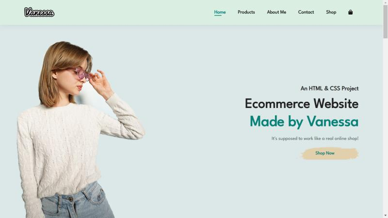

<!-- PROJECT LOGO -->
 

  

  <h2 align="center">An E-commerce Website Made with HTML, CSS, and JavaScript!</h2>

  

    I created this web page as a way to learn the three essential front-end tools from scratch.
  

 
